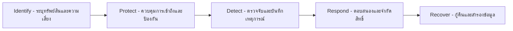

# บทที่ 2 ทฤษฎีและงานวิจัยที่เกี่ยวข้อง

การพัฒนาระบบ **SmartCAD-Inventory** ได้บูรณาการองค์ความรู้ กฎระเบียบภาครัฐ ทฤษฎีทางคอมพิวเตอร์ และมาตรฐานความมั่นคงปลอดภัยสากล โดยมีรายละเอียดของทฤษฎีและงานวิจัยที่เกี่ยวข้องตามมาตรฐานการอ้างอิงทางวิชาการ (APA 7th Edition) ดังนี้:

---

## 2.1 ระเบียบและมาตรฐานการบริหารพัสดุภาครัฐ (กรมบัญชีกลาง กระทรวงการคลัง)

### 2.1.1 เกณฑ์มาตรฐานการจำแนกประเภทและอายุการใช้งานครุภัณฑ์ (กรมบัญชีกลาง, 2560, 2566)
การบริหารจัดการสินทรัพย์ภาครัฐต้องเป็นไปตามแนวทางของระเบียบกระทรวงการคลังว่าด้วยการจัดซื้อจัดจ้างและการบริหารพัสดุภาครัฐ พ.ศ. 2560 (กรมบัญชีกลาง, 2560) และหลักเกณฑ์การจำแนกประเภทรายจ่ายตามงบประมาณ (หนังสือเวียนด่วนที่สุด ที่ กค 0405.3/ว 347) โดยเฉพาะการจำแนกประเภทครุภัณฑ์และการกำหนดอายุการใช้งานมาตรฐาน เพื่อประโยชน์ในการคำนวณค่าเสื่อมราคาและวางแผนการจำหน่ายพัสดุชำรุดหรือเสื่อมสภาพ

ในระบบ SmartCAD-Inventory ได้นำเกณฑ์ดังกล่าวมาสร้างเป็นกลไกจำแนกประเภทอัจฉริยะ (Smart Categorization & Keyword Matching Engine) ในโมดูล `js/config.js` (`CGD_CATEGORIES`) โดยกำหนดคำสำคัญ (Keywords) เพื่อการจำแนกประเภทอัตโนมัติ พร้อมกำหนดเกณฑ์เตือนภัย (Warning Threshold) และเกณฑ์วิกฤต (Critical Threshold) ดังตาราง:

| รหัสหมวดหมู่ | ชื่อหมวดหมู่ตามมาตรฐานกรมบัญชีกลาง | ตัวอย่างคำสำคัญในการจับคู่ (Keywords) | เกณฑ์แจ้งเตือน (Warning) | เกณฑ์วิกฤต (Critical) |
|---|---|---|:---:|:---:|
| `computer` | **ครุภัณฑ์คอมพิวเตอร์และสารสนเทศ** | คอมพิวเตอร์, computer, notebook, โน้ตบุ๊ก, laptop, เซิร์ฟเวอร์, server, pc, all-in-one, ipad, tablet, printer, เครื่องพิมพ์, scanner, UPS, สำรองไฟ, switch, router, access point | 3 ปี | 5 ปี |
| `office` | **ครุภัณฑ์สำนักงานและเฟอร์นิเจอร์** | โต๊ะ, เก้าอี้, ตู้, พาร์ทิชั่น, บอร์ด, ไวท์บอร์ด, โซฟา, ชั้นวาง, ชั้นเหล็ก, โพเดียม, เคาน์เตอร์, ตู้เซฟ, ตู้ล็อกเกอร์, ตู้เหล็ก, ตู้เอกสาร | 8 ปี | 12 ปี |
| `audio` | **ครุภัณฑ์โสตทัศนูปกรณ์และมัลติมีเดีย** | เครื่องเสียง, ไมโครโฟน, ไมค์, ลำโพง, โทรทัศน์, ทีวี, tv, กล้อง, camera, โปรเจกเตอร์, projector, จอรับภาพ, แอมป์, amplifier, มิกเซอร์ | 5 ปี | 8 ปี |
| `electrical` | **ครุภัณฑ์ไฟฟ้าและวิทยุ / เครื่องปรับอากาศ** | ปรับอากาศ, แอร์, air, พัดลม, ตู้เย็น, กาต้มน้ำ, เครื่องฟอกอากาศ, ไมโครเวฟ, เครื่องทำน้ำร้อน/เย็น, เครื่องดูดฝุ่น, เครื่องกำเนิดไฟฟ้า | 5 ปี | 8 ปี |
| `vehicle` | **ครุภัณฑ์ยานพาหนะและขนส่ง** | รถ, ยานพาหนะ, vehicle, รถยนต์, จักรยานยนต์, มอเตอร์ไซค์, รถกอล์ฟ, รถตู้, รถบรรทุก, เรือ | 6 ปี | 10 ปี |
| `scientific` | **ครุภัณฑ์การศึกษา วิทยาศาสตร์ และการแพทย์** | กล้องจุลทรรศน์, เครื่องมือวัด, ชุดทดลอง, แล็บ, lab, หุ่นจำลอง, วิทยาศาสตร์, การแพทย์ | 5 ปี | 8 ปี |
| `other` | **ครุภัณฑ์อื่นๆ** | กรณีที่ไม่ตรงกับกลุ่มใดข้างต้น | 5 ปี | 10 ปี |

สถานะของครุภัณฑ์ถูกแบ่งออกเป็น 3 ระดับตามเกณฑ์ทางสถิติ:
1. **ปกติ (Normal):** อายุการใช้งานยังไม่ถึงเกณฑ์แจ้งเตือน (สีเขียว)
2. **ใกล้ครบกำหนด (Warning):** อายุการใช้งานถึงเกณฑ์แจ้งเตือนแต่ยังไม่เกินเกณฑ์วิกฤต (สีส้ม/เหลือง)
3. **เกินกำหนด (Critical):** อายุการใช้งานถึงหรือเกินเกณฑ์วิกฤต ต้องพิจารณาตรวจสอบหรือจำหน่าย (สีแดง)

### 2.1.2 ทฤษฎีการคิดค่าเสื่อมราคาแบบเส้นตรง (Straight-Line Depreciation Method)
ค่าเสื่อมราคา (Depreciation) เป็นการกระจายต้นทุนของสินทรัพย์ตามระยะเวลาที่คาดว่าจะได้รับประโยชน์เชิงเศรษฐกิจ ระบบใช้วิธีเส้นตรง (Straight-Line Method) ตามมาตรฐานการบัญชีภาครัฐ (กรมบัญชีกลาง, 2562, 2566) โดยมีสูตรการคำนวณดังนี้:

$$Annual\ Depreciation = \frac{Cost\ Price - Residual\ Value}{Useful\ Life}$$

$$Remaining\ Net\ Book\ Value = Cost\ Price \times \left(1 - \min\left(1, \frac{Current\ Age}{Useful\ Life}\right)\right)$$

โดยกำหนดให้:
- $Cost\ Price$ คือ ราคาทุนของครุภัณฑ์ ณ วันที่จัดซื้อ
- $Useful\ Life$ คือ อายุการใช้งานที่คาดหมาย (ปี) ตามกลุ่มประเภทมาตรฐานกรมบัญชีกลาง
- $Current\ Age$ คือ อายุการใช้งานจริงนับจากวันที่ขึ้นทะเบียนจนถึงปัจจุบัน (ปี)
- $Residual\ Value$ (มูลค่าซาก) กำหนดเป็น 0 บาท หรือ 1 บาทตามระเบียบทางบัญชีราชการ
- มูลค่าคงเหลือสุทธิจะมีค่าต่ำสุดไม่น้อยกว่า 0 บาท

---

## 2.2 สถาปัตยกรรมระบบเว็บแอปพลิเคชัน (Web Application Architecture)

### 2.2.1 Client-Side Rendering (CSR) และ Single Page Application (SPA)
ระบบพัฒนาขึ้นด้วยแนวคิด Client-Side Rendering (CSR) ซึ่งเบราว์เซอร์ของผู้ใช้จะดาวน์โหลดไฟล์ HTML, CSS, JavaScript ในครั้งแรก และทำหน้าที่ประมวลผลตรรกะทางธุรกิจ (Business Logic), แปลงข้อมูลจากไฟล์ Excel (Client-side Parsing), และเรนเดอร์ส่วนต่อประสานผู้ใช้โดยตรง การเลือกใช้สถาปัตยกรรมนี้ส่งผลให้:
- ลดภาระการประมวลผลของเครื่องแม่ข่าย (Zero Server Compute Overhead)
- การตอบสนองของระบบมีความลื่นไหล รวดเร็ว ไม่มีการกระพริบหรือโหลดหน้าใหม่ทั้งหมดเมื่อเปลี่ยนการแสดงผล (Instant State Transitions)
- สามารถติดตั้งใช้งานบน Static Web Hosting หรือ Content Delivery Network (CDN) ได้อย่างสะดวก

### 2.2.2 Backend-as-a-Service (BaaS) ด้วย Supabase & PostgreSQL
Supabase ให้บริการโครงสร้างพื้นฐานระดับกลุ่มเมฆบนฐานข้อมูลเชิงสัมพันธ์ PostgreSQL 15+ ซึ่งมีจุดเด่นดังนี้:
- **ACID Compliant Database:** จัดเก็บข้อมูลอย่างมีบูรณภาพ รองรับความสัมพันธ์แบบ Foreign Keys และการทำ Indexing เพื่อการสืบค้นที่รวดเร็ว
- **Built-in Authentication Engine:** รองรับการยืนยันตัวตนด้วย JSON Web Token (JWT) พร้อมระบบ Session Management อัตโนมัติ
- **Remote Procedure Calls (RPC):** การสร้าง Stored Procedures และ Functions ในภาษา PL/pgSQL บนฐานข้อมูลโดยตรง ทำให้สามารถประมวลผลงานที่ต้องใช้สิทธิ์พิเศษได้อย่างปลอดภัย

---

## 2.3 มาตรฐานความมั่นคงปลอดภัยสารสนเทศ (Information Security Standards)

### 2.3.1 การประยุกต์ใช้กรอบการทำงาน NIST Cybersecurity Framework (NIST CSF 2.0; NIST, 2020)
การออกแบบระบบความปลอดภัยของ SmartCAD-Inventory อ้างอิงตามกรอบการทำงานของ National Institute of Standards and Technology (NIST SP 800-53 Rev. 5; NIST, 2020) และข้อพึงระวังตามมาตรฐาน OWASP Top 10 (OWASP Foundation, 2021) ใน 5 หน้าที่หลัก:

1. **Identify (การระบุ):** จำแนกกลุ่มข้อมูลสำคัญ กำหนดบทบาทผู้ใช้ตามหลักการ Role-Based Access Control (RBAC; Sandhu et al., 1996) ได้แก่ `superadmin`, `admin`, `staff`, `executive` และจำแนกข้อมูลที่เป็นความลับ
2. **Protect (การป้องกัน):**
   - **Closed Registration Policy:** ปิดระบบสมัครสมาชิกหน้าบ้าน ป้องกันผู้ไม่ประสงค์ดีจากการสร้างบัญชีโดยไม่ได้รับอนุญาต
   - **Row-Level Security (RLS):** นโยบายความปลอดภัยระดับตารางใน PostgreSQL (PostgreSQL Global Development Group, 2024) ทำให้ผู้ใช้ทั่วไปอ่านข้อมูลได้เท่านั้น ส่วนการแก้ไข ลบ หรืออัปโหลดต้องผ่านการตรวจสอบสิทธิ์ในระดับ Database Engine
   - **Secure RPC Function:** การสร้าง/แก้ไข/ลบผู้ใช้ทำผ่านฟังก์ชัน `admin_create_user`, `admin_update_user`, `admin_delete_user` ที่มีคำสั่ง `SECURITY DEFINER` ตรวจสอบสิทธิ์ผู้เรียก (Caller Role) ก่อนทำรายการทุกครั้ง
   - **XSS & Injection Protection:** ทำความสะอาดข้อมูล (Data Sanitization) ด้วยฟังก์ชัน `escHtml()` ก่อนการแสดงผลใน DOM ทุกจุด ป้องกันช่องโหว่ตาม OWASP A03: Injection (OWASP Foundation, 2021)
   - **Content Security Policy (CSP):** กำหนด Meta Tag เพื่อจำกัดแหล่งที่มาของ Script, Style, Fonts และ Data Connections
3. **Detect (การตรวจจับ):**
   - **Audit Logging System:** สร้างตาราง `activity_logs` เพื่อบันทึกเหตุการณ์สำคัญ (Login, Logout, Upload Batch, Delete Data, Create User, Update User, Delete User) พร้อม Timestamp และ User ID
4. **Respond & Recover (การตอบสนองและกู้คืน):**
   - ผู้ดูแลระบบระดับ `superadmin` สามารถระงับ เปลี่ยนสิทธิ์ รีเซ็ตรหัสผ่าน หรือลบบัญชีผู้ใช้ที่มีพฤติกรรมเสี่ยงได้ทันที
   - กำหนดระเบียบการสำรองข้อมูล (Offline Backups) และการแยกไฟล์ความลับออกจาก Git Repository ด้วย `.gitignore` อย่างเคร่งครัด

---

## 2.4 การแสดงผลข้อมูลเชิงภาพและการออกแบบประสบการณ์ผู้ใช้ (Data Visualization & UX/UI)

### 2.4.1 การออกแบบแดชบอร์ดแบบ Multi-dimensional Drill-Down (Few, 2013; Shneiderman et al., 2016)
ทฤษฎีการออกแบบส่วนต่อประสานเชิงภาพเน้นการนำเสนอข้อมูลตามหลัก Visual Information Seeking Mantra ของ Shneiderman et al. (2016) คือ *"Overview first, zoom and filter, then details-on-demand"*:
- การนำเสนอผ่าน **KPI Scorecards** (Few, 2013) ให้ข้อมูลสรุปตัวเลขที่สำคัญในทันที
- การนำเสนอผ่าน **Interactive Charts** (Chart.js Contributors, 2024) โดยผูกเหตุการณ์ `onClick` เข้ากับโมดอลแสดงรายการที่ผ่านการกรอง (Dynamic Filtered Modal)
- การนำเสนอผ่าน **Slide-out Detail Panel** ทางขวามือ เมื่อคลิกที่แถวของตารางหรือข้อมูลในชาร์ต จะเปิดแผงข้อมูลแสดงประวัติ ราคา ค่าเสื่อมราคา สถานที่ตั้ง และผู้ครอบครองโดยไม่ต้องสลับหน้าจอ

### 2.4.2 ระบบธีมและการเข้าถึงได้ (Accessibility & Theming; W3C, 2018; ISO/IEC, 2011)
ระบบใช้ CSS Custom Properties เพื่อสร้าง Dynamic Theme Engine รองรับ:
- **Light Theme:** ค่าคอนทราสต์สูง อ่านง่ายในที่สว่าง (สอดคล้องกับมาตรฐาน Web Content Accessibility Guidelines - WCAG 2.1 ระดับ AA; World Wide Web Consortium [W3C], 2018)
- **Dark Theme:** ใช้พาเล็ตสีโทนมืดแบบสุขุม เพื่อลดความล้าของสายตาเมื่อใช้งานเป็นเวลานาน
- **Auto Mode:** สลับธีมตามค่าของระบบปฏิบัติการอัตโนมัติผ่าน CSS Media Query `prefers-color-scheme`
- สอดคล้องตามแบบจำลองคุณภาพซอฟต์แวร์ ISO/IEC 25010:2011 ด้าน Usability, Performance Efficiency, และ Security (ISO/IEC, 2011)

---

*(ดูรายการเอกสารอ้างอิงฉบับสมบูรณ์ตามมาตรฐาน APA 7th Edition ได้ที่ [References_APA.md](References_APA.md))*
