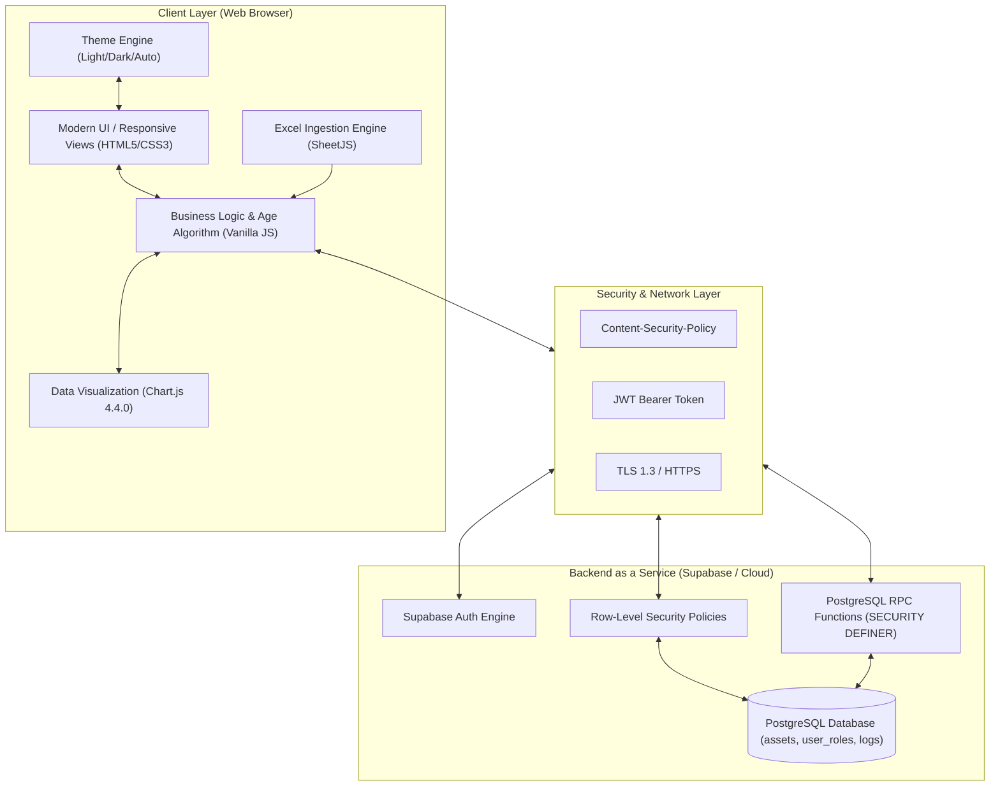

# บทที่ 3 วิธีดำเนินการวิจัยและพัฒนาระบบ

บทนี้อธิบายถึงระเบียบวิธีดำเนินการวิจัย กระบวนการออกแบบสถาปัตยกรรมระบบ โครงสร้างฐานข้อมูล อัลกอริทึมการประมวลผลอายุครุภัณฑ์และค่าเสื่อมราคา ตลอดจนกระบวนการรักษาความมั่นคงปลอดภัยตามมาตรฐานสากล

---

## 3.1 สถาปัตยกรรมของระบบ (System Architecture)

ระบบ SmartCAD-Inventory ได้รับการออกแบบตามสถาปัตยกรรมแบบแยกส่วน (Decoupled Client-BaaS Architecture) ดังแสดงในแผนภาพ:



### คำอธิบายองค์ประกอบของสถาปัตยกรรม:
1. **Client Presentation & Logic Layer:** ทำงานบน Web Browser โดยสมบูรณ์ ไม่จำเป็นต้องติดตั้งโปรแกรมเพิ่มเติม รองรับ Responsive Web Layout สำหรับทุกขนาดหน้าจอ
2. **Security & Transport Layer:** สื่อสารผ่านโปรโตคอล HTTPS (TLS 1.3) และป้องกันการโหลดสคริปต์ภายนอกที่ไม่ได้รับอนุญาตด้วย Content Security Policy
3. **Cloud Database & Auth Layer:** ฐานข้อมูล PostgreSQL บริหารจัดการสิทธิ์ในระดับตารางและแถวข้อมูลผ่าน RLS Policies

---

## 3.2 การออกแบบโครงสร้างฐานข้อมูล (Database Schema Design; PostgreSQL Global Development Group, 2024)

ฐานข้อมูลได้รับการออกแบบบน PostgreSQL 15+ ภายใต้สถาปัตยกรรมรวมศูนย์ในไฟล์ Master Schema [`database/schema.sql`](../database/schema.sql) ประกอบด้วย 4 ตารางหลัก ได้แก่:

### 3.2.1 ตาราง `user_roles` (การจัดการบทบาทผู้ใช้งานและการควบคุมการเข้าถึง)
ใช้กำหนดและตรวจสอบสิทธิ์ของผู้ใช้งานแต่ละบัญชีตามมาตรฐาน Role-Based Access Control (RBAC; Sandhu et al., 1996) โดยอ้างอิง foreign key ไปยังระบบ `auth.users` ของ Supabase พร้อมจัดเก็บอีเมลเพื่อความสะดวกรวดเร็วในการบริหารจัดการ

```sql
CREATE TABLE IF NOT EXISTS public.user_roles (
  id         UUID PRIMARY KEY DEFAULT gen_random_uuid(),
  user_id    UUID UNIQUE REFERENCES auth.users(id) ON DELETE CASCADE,
  role       TEXT NOT NULL CHECK (role IN ('superadmin', 'admin', 'staff', 'executive', 'editor', 'viewer')),
  full_name  TEXT,
  email      TEXT,
  created_at TIMESTAMPTZ DEFAULT NOW()
);
```

### 3.2.2 ตาราง `upload_batches` (ประวัติการนำเข้าไฟล์)
เก็บบันทึกประวัติการอัปโหลดไฟล์ Excel แต่ละครั้ง เพื่อให้สามารถตรวจสอบย้อนหลังหรือลบข้อมูลเป็นรายชุดได้

```sql
CREATE TABLE IF NOT EXISTS upload_batches (
  id          UUID PRIMARY KEY DEFAULT gen_random_uuid(),
  filename    TEXT NOT NULL,
  uploaded_by UUID REFERENCES auth.users(id),
  total_rows  INT DEFAULT 0,
  note        TEXT,
  created_at  TIMESTAMPTZ DEFAULT NOW()
);
```

### 3.2.3 ตาราง `assets` (ทะเบียนข้อมูลครุภัณฑ์หลัก)
จัดเก็บข้อมูลครุภัณฑ์รายชิ้นอย่างละเอียด ใช้ `BIGSERIAL` เป็น Primary Key (`pk`) เพื่อป้องกันปัญหา ID ชนกันระหว่างชุดข้อมูล

```sql
CREATE TABLE IF NOT EXISTS assets (
  pk              BIGSERIAL PRIMARY KEY,
  id              BIGINT,
  asset_key       TEXT,
  registered_date DATE,
  cost            NUMERIC(15,2),
  description_sys TEXT,
  name            TEXT NOT NULL,
  detail          TEXT,
  brand           TEXT,
  model           TEXT,
  serial_number   TEXT,
  warranty_years  NUMERIC(5,1),
  department      TEXT,
  condition       TEXT,
  building        TEXT,
  floor           TEXT,
  room            TEXT,
  storage_detail  TEXT,
  owner           TEXT,
  assignee        TEXT,
  note            TEXT,
  upload_batch_id UUID REFERENCES upload_batches(id) ON DELETE CASCADE,
  created_at      TIMESTAMPTZ DEFAULT NOW()
);
```

### 3.2.4 ตาราง `activity_logs` (บันทึกประวัติการปฏิบัติงาน / Audit Trail)
บันทึกเหตุการณ์สำคัญที่เกิดขึ้นในระบบ เพื่อความโปร่งใสและการตรวจสอบย้อนหลังตามมาตรฐาน NIST

```sql
CREATE TABLE IF NOT EXISTS activity_logs (
  id          UUID PRIMARY KEY DEFAULT gen_random_uuid(),
  user_id     UUID REFERENCES auth.users(id) ON DELETE SET NULL,
  action      TEXT NOT NULL,
  details     TEXT,
  created_at  TIMESTAMPTZ DEFAULT NOW()
);
```

### 3.2.5 การสร้างดัชนีเพื่อเพิ่มประสิทธิภาพ (Database Indexing)
เพื่อรองรับการสืบค้น การจัดกลุ่ม และการกรองข้อมูลจำนวนมากแบบเรียลไทม์ ได้มีการสร้าง B-Tree Indexes ในฟิลด์ที่มีการ Query บ่อย:
- `idx_assets_department` บนฟิลด์ `department`
- `idx_assets_condition` บนฟิลด์ `condition`
- `idx_assets_building` บนฟิลด์ `building`
- `idx_assets_registered_date` บนฟิลด์ `registered_date`
- `idx_assets_upload_batch` บนฟิลด์ `upload_batch_id`
- `idx_assets_name` บนฟิลด์ `name`

---

## 3.3 อัลกอริทึมการประมวลผลและการคำนวณอายุครุภัณฑ์อัจฉริยะ

### 3.3.1 ผังการทำงานของอัลกอริทึมการสกัดวันที่ (Smart Fallback Date Extraction Flow)
ในการนำเข้าข้อมูลทะเบียนพัสดุ มักพบปัญหาข้อมูลวันที่สูญหายหรือไม่สมบูรณ์ ระบบจึงใช้อัลกอริทึมการสกัดวันที่แบบหลายระดับ (Multi-tier Extraction):

```mermaid
graph TD
    Start([เริ่มประมวลผลรายการครุภัณฑ์]) --> CheckDate{มีข้อมูล registered_date หรือไม่?}
    
    CheckDate -- มีข้อมูล --> CleanFormat[ทำความสะอาดข้อความ ลบอักขระพิเศษ LTR/RTL]
    CleanFormat --> ParseDate[แปลงรูปแบบ DD-MM-YYYY หรือ YYYY-MM-DD]
    ParseDate --> CheckBE{ปี พ.ศ. > 2400 หรือไม่?}
    CheckBE -- ใช่ --> ConvertAD[แปลงเป็น ค.ศ. = พ.ศ. - 543]
    CheckBE -- ไม่ใช่ --> SetDate[กำหนดค่า Date สำเร็จ]
    ConvertAD --> SetDate
    
    CheckDate -- ไม่มี/แปลงไม่ได้ --> CheckAssetID{มีรหัสครุภัณฑ์ asset_id หรือไม่?}
    CheckAssetID -- มี --> MatchRegex[ตรวจสอบรูปแบบ Regex: /\.ร(\d{2})/]
    MatchRegex -- พบ Pattern --> ExtractYear[ดึงปี พ.ศ. สองหลัก เช่น 60 -> 2560 -> 2017]
    ExtractYear --> SetFallbackDate[กำหนดวันที่เป็น 1 มกราคม ของปีนั้น]
    MatchRegex -- ไม่พบ Pattern --> SetUnknown[กำหนดสถานะเป็น 'ไม่ทราบ']
    CheckAssetID -- ไม่มี --> SetUnknown
    
    SetDate --> CalcAge[คำนวณอายุจริง = วันปัจจุบัน - วันขึ้นทะเบียน]
    SetFallbackDate --> CalcAge
    CalcAge --> MatchCategory[จำแนกประเภทด้วย Keyword Matching]
    MatchCategory --> EvalStatus[ประเมินสถานะ: ปกติ / ใกล้ครบกำหนด / เกินกำหนด]
    EvalStatus --> CalcDepr[คำนวณค่าเสื่อมราคาและมูลค่าคงเหลือสุทธิ]
    CalcDepr --> End([จบกระบวนการ])
    SetUnknown --> End
```

### 3.3.2 ตรรกะการจำแนกประเภทและการคำนวณค่าเสื่อมราคา (Depreciation Calculation Logic)
ระบบใช้ฟังก์ชัน `getUsefulLife(name)` และ `calcDepreciation(asset)` ใน `dashboard.html` เพื่อคำนวณมูลค่าคงเหลือสุทธิแบบ Real-time:

```javascript
function getUsefulLife(name) {
  const n = (name || '').toLowerCase();
  if (/คอมพิวเตอร์|computer|notebook|laptop|แล็ปท็อป|โน้ตบุ๊ค|tablet|ipad|printer|เครื่องพิมพ์|scanner|โปรเจ็คเตอร์|projector|monitor|จอภาพ|จอคอม|โทรศัพท์|phone|server|switch|router/.test(n)) return 5;
  if (/รถ|ยานพาหนะ|vehicle|รถยนต์|รถจักรยาน|มอเตอร์ไซค์|เรือ/.test(n)) return 10;
  if (/โต๊ะ|เก้าอี้|ตู้|ชั้น|เฟอร์นิเจอร์|ผ้าม่าน|พรม/.test(n)) return 15;
  if (/เครื่องปรับอากาศ|แอร์|ตู้เย็น|refrigerator|เครื่องซักผ้า/.test(n)) return 10;
  return 10; // Default
}

function calcDepreciation(asset) {
  if (!asset.cost || asset.cost <= 0 || !asset.registered_date) 
    return { remaining: 0, depreciationPct: 100, usefulLife: 10, ageYears: 0 };
  const usefulLife = getUsefulLife(asset.name);
  const ageYears = Math.max(0, (Date.now() - new Date(asset.registered_date).getTime()) / (365.25 * 24 * 3600 * 1000));
  const rate = Math.min(1, ageYears / usefulLife);
  return { 
    remaining: Math.max(0, asset.cost * (1 - rate)), 
    depreciationPct: rate * 100, 
    usefulLife, 
    ageYears 
  };
}
```

---

## 3.4 การพัฒนาระบบแดชบอร์ดและการแสดงผลข้อมูล (Dashboard Architecture)

แดชบอร์ดได้รับการพัฒนาขึ้นใหม่เป็นระบบ **2-Tab Architecture**:

1. **Tab 1: ภาพรวม (Overview):**
   - **8 KPI Cards:** ครุภัณฑ์ทั้งหมด, มูลค่าราคาทุนรวม, มูลค่าคงเหลือสุทธิ, สภาพดี, สภาพปานกลาง, ชำรุด, เกินอายุกำหนด, มูลค่าเฉลี่ยต่อรายการ
   - **6 Interactive Charts with Full Drill-Down:** 
     1. สัดส่วนตามสภาพ (Doughnut)
     2. จำนวนแยกตามงาน (Bar)
     3. แนวโน้มการจัดซื้อตามปีและมูลค่า (Dual-Axis Line)
     4. **สัดส่วนตามหมวดหมู่มาตรฐานกรมบัญชีกลาง (CGD Category Breakdown Doughnut)**
     5. Top 10 ชนิดครุภัณฑ์ที่มีจำนวนมากที่สุด (Horizontal Bar)
     6. สถานะอายุการใช้งาน (Doughnut with Legend Metrics)
   - **Alert Action Table:** ตารางครุภัณฑ์ที่ชำรุดหรือเกินอายุการใช้งานที่ต้องดำเนินการ
   - **Audit Activity Log Table:** ตารางแสดงประวัติการทำงานล่าสุดในระบบ
2. **Tab 2: วิเคราะห์เชิงลึก (Deep Analytics):**
   - **4 Financial KPIs:** มูลค่าราคาทุนรวม, มูลค่าคงเหลือปัจจุบัน, ค่าเสื่อมราคาสะสมรวม, มูลค่าสินทรัพย์ที่มีความเสี่ยง (ชำรุด)
   - **Value by Department Chart:** กราฟเปรียบเทียบราคาทุน vs มูลค่าคงเหลือแยกตามงาน
   - **Age Distribution Histogram:** กราฟการกระจายตัวของอายุครุภัณฑ์ (0-5 ปี, 6-10 ปี, 11-15 ปี, 16-20 ปี, 20+ ปี)
   - **Location Breakdown Table:** ตารางวิเคราะห์การกระจายตัวของสินทรัพย์ตามอาคารพร้อม Mini Progress Bar
   - **Warranty Status & Expiry Tracker:** ชาร์ตสถานะการรับประกันและตารางแจ้งเตือน 5 อันดับแรกที่ใกล้หมดประกัน
   - **Department Scorecard:** ตารางสรุปสมรรถนะของทุกงาน (จำนวน, ราคาทุน, มูลค่าคงเหลือ, % สภาพดี, อายุเฉลี่ย, จำนวนชำรุด)
   - **Top 10 High-Value Assets:** ตาราง 10 อันดับครุภัณฑ์ที่มีราคาทุนสูงสุดพร้อมมูลค่าคงเหลือ
3. **Asset Detail Slide Panel & Drill-Down Modal:**
   - การคลิกที่ KPI Card, แท่งกราฟ, โดนัทชาร์ต, หรือแถวของตารางจะเปิดหน้าต่าง Modal หรือแผงเลื่อนด้านข้าง (Side Panel) เพื่อแสดงรายละเอียดสินทรัพย์อย่างสมบูรณ์

---

## 3.5 มาตรการความมั่นคงปลอดภัยและการทดสอบ (Security Hardening & Testing; NIST, 2020; OWASP Foundation, 2021)

1. **การควบคุมการสร้าง/แก้ไข/ลบผู้ใช้ผ่าน Database Function:** ใช้ Stored Procedures ที่มีคำสั่ง `SECURITY DEFINER` ได้แก่ `admin_create_user`, `admin_update_user`, `admin_delete_user` ที่ฝังคำสั่งตรวจสอบว่าผู้เรียกต้องมีบทบาท `superadmin` หรือ `admin` เท่านั้น
2. **Cross-Site Scripting (XSS) Sanitization:** ฟังก์ชัน `escHtml()` แปลงอักขระ `&`, `<`, `>`, `"`, `'` เพื่อป้องกันการฝัง Payload ในชื่อครุภัณฑ์หรือหมายเหตุ ตามข้อแนะนำ OWASP A03:2021 Injection (OWASP Foundation, 2021)
3. **Content Security Policy (CSP):** กำหนดนโยบายจำกัดเฉพาะโดเมนของ Supabase, CDN ของ Google Fonts, Chart.js และ jsDelivr
4. **Git Repository Sanitization:** กำหนด `.gitignore` เพื่อป้องกันการ Commit ข้อมูลไฟล์ Excel, ไฟล์สำรองฐานข้อมูล และโฟลเดอร์งานวิจัยขึ้นสู่ระบบควบคุมเวอร์ชันสาธารณะ

---

*(ดูรายการเอกสารอ้างอิงฉบับสมบูรณ์ตามมาตรฐาน APA 7th Edition ได้ที่ [References_APA.md](References_APA.md))*
