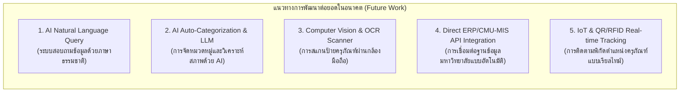

# บทที่ 5 สรุปผลการวิจัย ข้อจำกัด และข้อเสนอแนะ

---

## 5.1 สรุปผลการวิจัยและพัฒนา

การวิจัยและพัฒนาระบบ **SmartCAD-Inventory (ระบบบริหารจัดการครุภัณฑ์ กองบริหารงานกลาง สำนักงานมหาวิทยาลัย มหาวิทยาลัยเชียงใหม่)** ประสบผลสำเร็จตามวัตถุประสงค์ที่ตั้งไว้ทุกประการ โดยระบบสามารถแก้ไขปัญหาดั้งเดิมของการบริหารจัดการพัสดุผ่านระบบกระดาษคำนวณได้อย่างเป็นรูปธรรม:

1. **การรวมศูนย์ข้อมูล (Centralized Data Management):** ระบบได้เปลี่ยนผ่านข้อมูลจากไฟล์กระดาษคำนวณที่กระจัดกระจาย มาสู่ฐานข้อมูลออนไลน์บนคลาวด์ PostgreSQL ผ่านบริการ Supabase ทำให้มีศูนย์กลางข้อมูลที่ถูกต้อง เป็นหนึ่งเดียว และเข้าถึงได้ทุกที่ทุกเวลา
2. **ระบบการประเมินอายุและค่าเสื่อมราคาอัตโนมัติ:** การประยุกต์ใช้อัลกอริทึม Rule-Based Matching ร่วมกับตรรกะ Fallback สกัดปีจากรหัสครุภัณฑ์ และการคำนวณค่าเสื่อมราคาแบบเส้นตรง (Straight-Line Depreciation) ตามเกณฑ์กรมบัญชีกลาง ช่วยลดภาระงานของเจ้าหน้าที่พัสดุและขจัดข้อผิดพลาดจากการคำนวณด้วยมือได้อย่างสิ้นเชิง
3. **การแสดงผลแดชบอร์ด 2 มิติ (Overview & Deep Analytics):** การจัดโครงสร้างแดชบอร์ดเป็น 2 แท็บ พร้อมระบบโต้ตอบแบบ Drill-Down และ Slide-out Asset Detail Panel ช่วยให้ทั้งผู้ปฏิบัติงานและผู้บริหารระดับสูงสามารถเข้าถึงข้อมูลเชิงสถิติ มูลค่าสินทรัพย์ และความเสี่ยงได้อย่างสะดวกรวดเร็ว
4. **ความมั่นคงปลอดภัยสารสนเทศตามมาตรฐาน NIST CSF:** ระบบมีกลไกป้องกันความปลอดภัยที่เข้มงวด ทั้งการปิดระบบลงทะเบียนอิสระ (Closed Registration), การบังคับใช้นโยบาย Row-Level Security (RLS) ในระดับฐานข้อมูล, การป้องกันช่องโหว่ XSS, และการเก็บบันทึกประวัติการทำงาน (Audit Trail) อย่างโปร่งใส
5. **การออกแบบประสบการณ์ผู้ใช้ (UX/UI Excellence):** การนำอัตลักษณ์สีของมหาวิทยาลัยเชียงใหม่ (CMU Purple & Gold) มาออกแบบระบบธีม (Light / Dark / Auto) ช่วยเพิ่มความสบายตาและยกระดับความน่าใช้งานของระบบตามมาตรฐานสากล

---

## 5.2 ปัญหา อุปสรรค และข้อจำกัดของระบบ (Limitations & Constraints)

1. **คุณภาพของข้อมูลตั้งต้น (Data Quality Dependency):** ความแม่นยำของอัลกอริทึมการจำแนกหมวดหมู่ขึ้นอยู่กับความสมบูรณ์ของการบันทึกชื่อครุภัณฑ์และรหัสสินทรัพย์ในอดีต หากมีการสะกดผิดหรือไม่ระบุคำสำคัญ อาจส่งผลให้ระบบจัดเข้ากลุ่ม 'ทั่วไป' (Default)
2. **การนำเข้าข้อมูลยังคงอาศัยการอัปโหลดไฟล์ Excel:** แม้ระบบจะประมวลผลไฟล์ได้อย่างรวดเร็ว แต่ยังคงต้องอาศัยเจ้าหน้าที่ในการดาวน์โหลดไฟล์ทะเบียนพัสดุจากระบบ ERP หลักของมหาวิทยาลัยมาอัปโหลดเข้าสู่ระบบ
3. **ความถูกต้องของระยะเวลารับประกัน (Warranty Tracking):** สินค้าหรือครุภัณฑ์รุ่นเก่าบางรายการไม่มีการระบุปีรับประกันในทะเบียนพัสดุเดิม ทำให้ระบบต้องแสดงสถานะเป็น 'ไม่มีข้อมูล'

---

## 5.3 ข้อเสนอแนะและแนวทางการพัฒนาต่อยอด (Future Works & Recommendations)

เพื่อให้ระบบ SmartCAD-Inventory มีความสมบูรณ์และชาญฉลาดยิ่งขึ้นในอนาคต จึงมีแนวทางการพัฒนาต่อยอดดังนี้:

1. **การพัฒนาระบบสืบค้นด้วยภาษาธรรมชาติ (AI Natural Language Query / Chatbot):** นำเทคโนโลยี Generative AI หรือ Large Language Model (LLM) มาเชื่อมต่อกับฐานข้อมูล เพื่อให้ผู้บริหารและเจ้าหน้าที่สามารถสอบถามข้อมูล เช่น *"ขอดูรายการคอมพิวเตอร์ที่อายุเกิน 5 ปีในอาคารยุทธศาสตร์"* และระบบสามารถตอบคำถามพร้อมแสดงตารางสรุปได้ทันที
2. **การจัดหมวดหมู่อัตโนมัติด้วย AI (AI Auto-Categorization):** ใช้ Machine Learning Classification ในการจำแนกประเภทและประเมินอายุการใช้งานจากคำบรรยายลักษณะครุภัณฑ์ เพื่อลดข้อจำกัดของ Rule-Based Keyword Matching
3. **ระบบสแกนตรวจสอบพัสดุภาคสนาม (Computer Vision & OCR Mobile Scanning):** พัฒนาโมบายแอปพลิเคชันหรือเว็บที่รองรับการเปิดกล้องโทรศัพท์มือถือ เพื่อสแกน Barcode, QR Code หรืออ่านตัวอักษรบนป้ายครุภัณฑ์ (OCR) แล้วดึงข้อมูลทะเบียนพัสดุขึ้นมาแสดงผลและอัปเดตสภาพการใช้งานภาคสนามได้ทันที
4. **การเชื่อมโยงข้อมูลแบบอัตโนมัติผ่าน RESTful API (ERP Integration):** พัฒนา Connector เพื่อเชื่อมต่อระบบฐานข้อมูลเข้ากับระบบ CMU-MIS หรือ ERP ของมหาวิทยาลัยเชียงใหม่โดยตรง เพื่อให้ข้อมูลอัปเดตแบบอัตโนมัติโดยไม่ต้องผ่านการอัปโหลดไฟล์ Excel
5. **การขยายผลสู่ระบบสารสนเทศระดับมหาวิทยาลัย (University-wide Scaling):** ปรับปรุงโครงสร้างสถาปัตยกรรมให้รองรับการแบ่งหน่วยงานแบบ Multi-tenancy เพื่อให้คณะและส่วนงานอื่น ๆ ภายในมหาวิทยาลัยเชียงใหม่สามารถนำระบบไปใช้งานในหน่วยงานของตนเองได้
